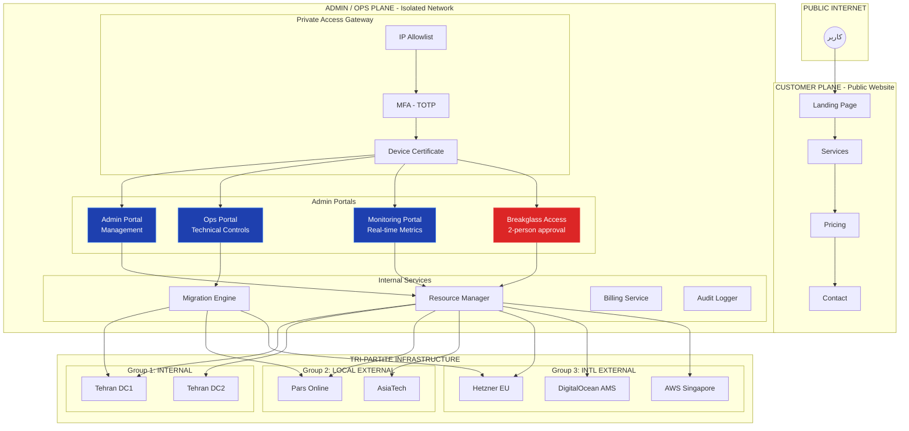
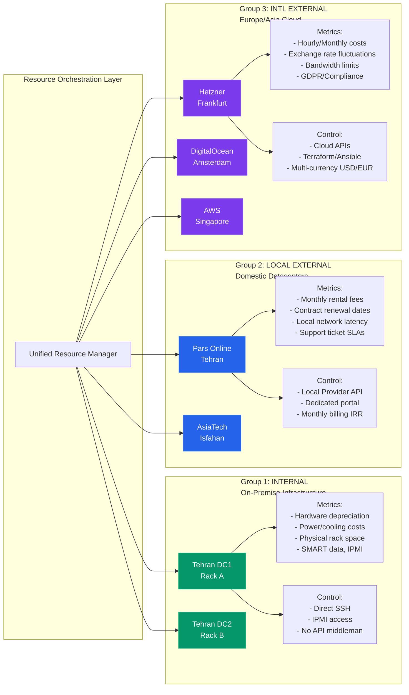
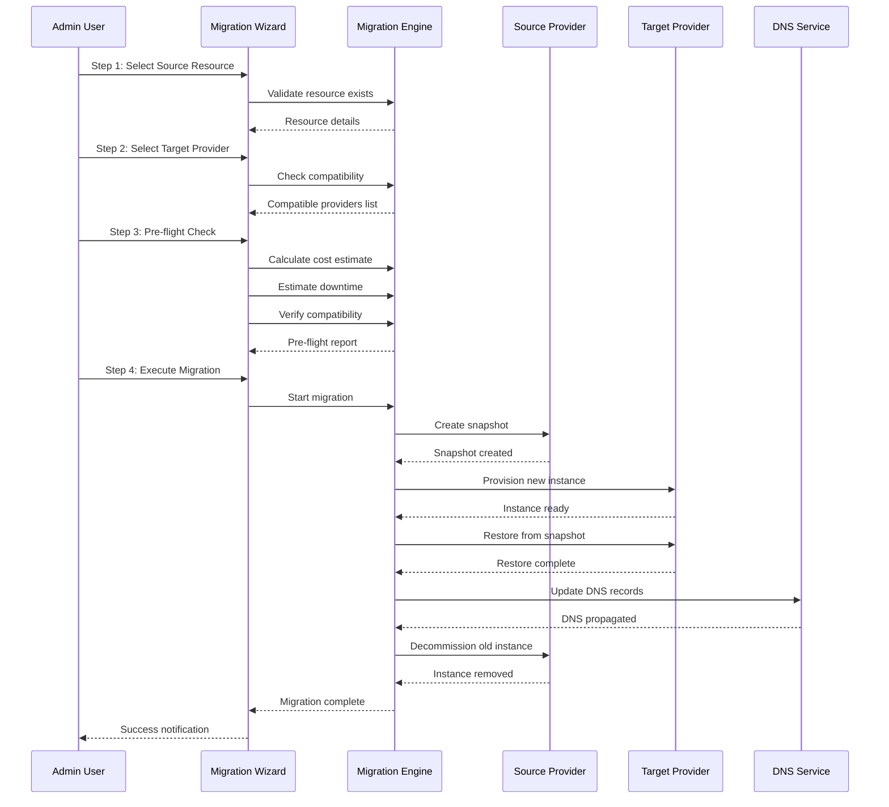
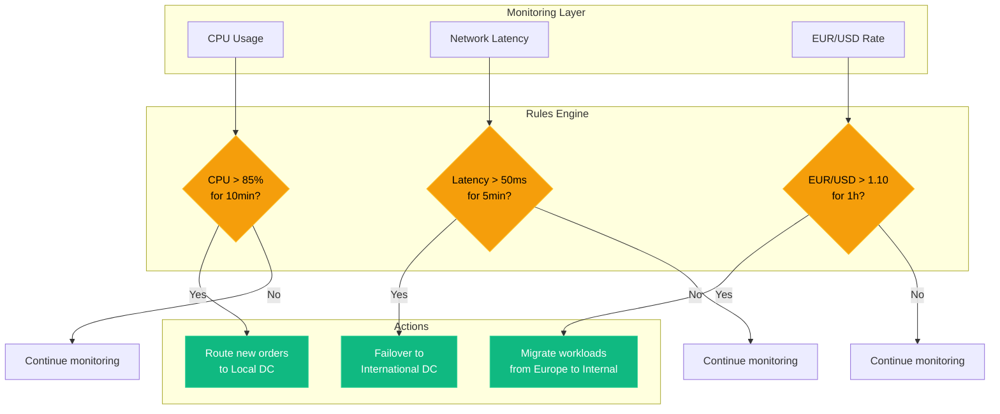
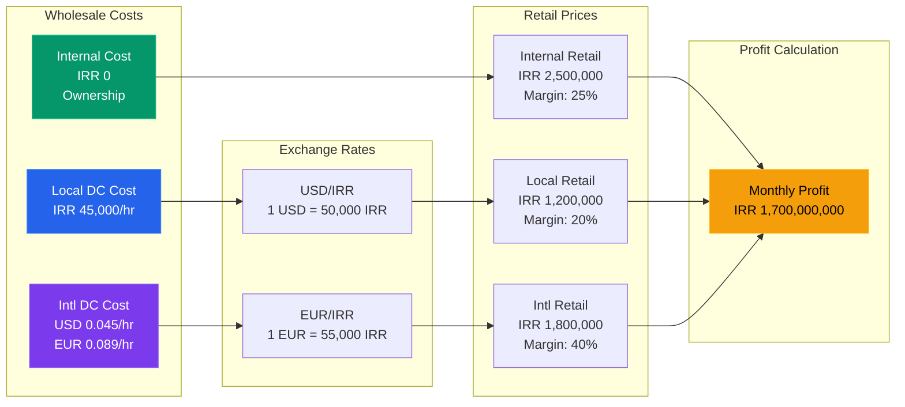
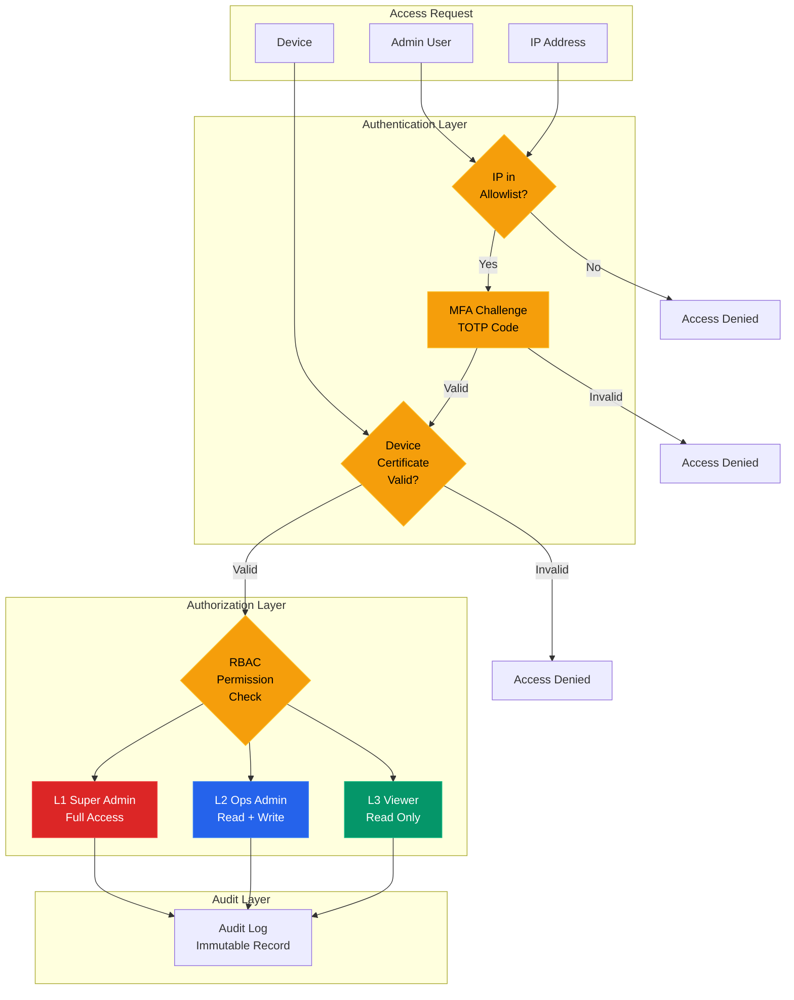

# 🏗️ Architecture Diagrams - Mermaid.js

## 1. Isolated Admin Plane vs Public Plane

## 2. Tri-Partite Provider Infrastructure Model

## 3. Migration Engine Workflow

## 4. Auto-Balancing Rules Engine

## 5. Multi-Currency Financial Flow

## 6. Zero Trust Access Control

---

**تمامی نمودارها با Mermaid.js قابل رندر هستند و معماری کامل سیستم را نشان می‌دهند.**
